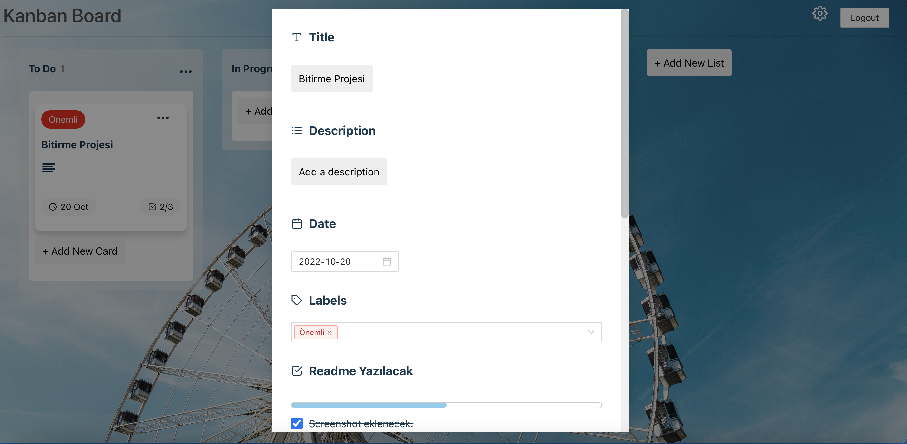

# Kanban Board

> Geliştirmiş olduğum projede login, register, dashboard ve board sayfaları yer almaktadır. Uygulamaya kullanıcı adı ile girişi yapılıp board, liste ve kart eklenip süreç takibi yapılabilir.

## İçindekiler

* [Kullanılan Teknolojiler](#kullanılan-teknolojiler)
* [Özellikleri](#özellikleri)
* [Kurulumu](#kurulumu)
* [Ekran Görüntüleri](#ekran-görüntüleri)

## Kullanılan Teknolojiler
- React.js-TypeScript
- Css
- React-beautiful-dnd (kullanılan kütüphane)

## Özellikleri
- Kayıt olunup, kullanıcı adı ve şifre ile giriş yapılmaktadır.
- Eklenen board, liste ve kartların adı değiştirilip, silinebilmektedir.
- Kartların içerisine açıklama, tarih, statü ve checklist itemları eklenip, tekrar güncellenebilmektedir. Ayrıca kartların içerisine yorum yapılabilmektedir.
- Eklenen listenin ve kartların sırası sürükle bırak yöntemi ile değiştirilebilmektedir.
- Kartların yeri sürükle bırak yöntemi ile listeler arasında değiştirilebilmektedir.
- Eklenen board'u başka kullanıcı ile eklenip birlikte süreç takibi yapılabilmektedir.

## Kurulumu
İşlem adımları aşağıdaki gibidir.
- npm install
- npm start

## Ekran Görüntüleri

### Login Sayfası

### Register Sayfası

### Dashboard Sayfası

### Board Sayfası

### CardInfo Sayfası

